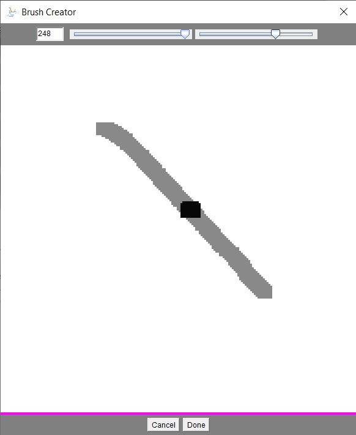
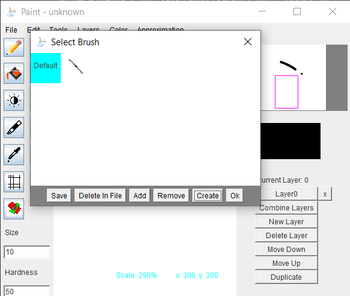
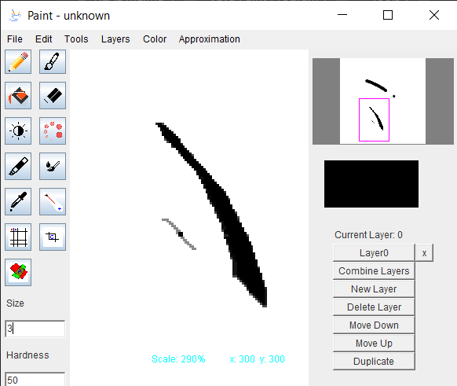

# Java Paint Program
This is a brief summary of general the latest version of the program.

## Table of Contents
[Shortcuts](#keyboardmouse-shortcuts)\
[Getting-Started](#getting-started)
### Tools
[Paintbrush](#paintbrush)\
[Contrast/Saturation](#contrast-and-saturation)\
[Line-Tool](#line-tool)\
[Crop](#crop)\
[Sprite-Sheet-Generator](#sprite-sheet-generator)\
[Filter](#filter)

# Keyboard/Mouse Shortcuts
Undo - CTRL+Z (Only depth 1)\
Panning - ALT+MOUSE_DRAG or MIDDLE_MOUSE_DRAG\
Rotating - CTRL+MOUSE_DRAG\

# Getting Started
Start by either load image by specify file path (accepts png and jpeg format)\
or create new blank image by specifying dimensions\
Alternatively you can screenshot entire screen to begin with image with size equal to screen dimensions.\
Import option is used to load file image as new layer, loading image with dimensions greater than base layer is not supported

# Tools
This section explains certain tools requiring more careful explanation\
Generally when selected, tools can be operated by left, right mouse button or mouse scroll
## Paintbrush
There are two modes for the paintbrush generally: default brush and custom brush\
Default brush is as expected with brush head computed using radial distance from draw coordinate

Custom brush uses self defined image as brush head, with darkscale representing the transparency

## Contrast and Saturation
This is operated by selecting the tool and scrolling\
Scrolling up increases the value and down to decrease the value\
Because this is not a filter, the process is non reversible as applying the tool will cause loss in data

## Line Tool
Select first coordinate by left mouse, second coordinate by right mouse, press enter to finish drawing
Line material is same as paintbrush tool

## Crop
Select first coordinate by left mouse, second coordinate by right mouse,\
press enter to crop image into rectangular box bounded by the two coordinates

## Sprite Sheet Generator
Converts all layer into one by tiling them in ascending order, this assumes all layers have same dimension\
First parameter is number of images per row, second parameter is number of images per column,\
Missing image will be substituted by transparent background

## Filter
Filters image leaving only parts that corresponds to selected color while setting everything else white\
slight deviation in color can be allowed by threshold value given by "Size" parameter

# Approximator
On/Off in dialog turns approximator feature on or off\
this feature dampens cursor movement speed with strength corresponding to the value given\
Higher value means longer time required to reach mouse location\
This can lessen the effect of a shaky mouse